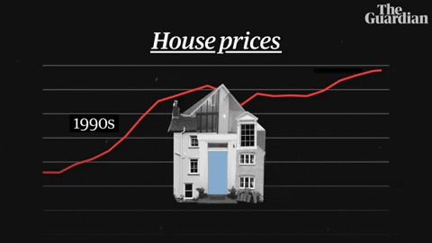

# 🌃 Análise e Predição de Preços de Imóveis de NY 

## 👀 Introdução: 

Esse projeto traz dados sobre aluguéis de Imóveis em Nova York com o objetivo principal de criar um modelo de predição de preço. Os dados atrás diferentes atributos que impactam no preço dos imóveis, e com esses dados foi passado por etapas de pré-processamento de dados , análise exploratória e criação de modelos preditivos (regressão, classificação e agrupamento) para geração de insights.

## 🕵🏾‍♂️ Justificativa:

Alocação para um time que está trabalhando atualmente junto a um cliente no processo de criação de uma plataforma de aluguéis temporários na cidade de Nova York. Para o desenvolvimento de sua estratégia de precificação, pediu para que fizesse uma análise exploratória dos dados de seu maior concorrente, assim como um teste de validação de um modelo preditivo.

